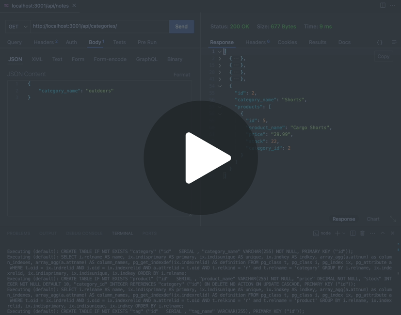

# E-Commerce Backstage

This is an E-commerce site, with a configured working Express.js API to use Sequelize to interact with a PostgreSQL database.

## User Story

AS A manager at an internet retail company 
I WANT a back end for my e-commerce website that uses the latest technologies 
SO THAT my company can compete with other e-commerce companies

## Acceptance Criteria

GIVEN a functional Express.js API
* WHEN I add my database name, PostgreSQL username, and PostgreSQL password to an environment variable file 
THEN I am able to connect to a database using Sequelize
* WHEN I enter schema and seed commands 
THEN a development database is created and is seeded with test data
* WHEN I enter the command to invoke the application 
THEN my server is started and the Sequelize models are synced to the PostgreSQL database
* WHEN I open API GET routes in Insomnia for categories, products, or tags 
THEN the data for each of these routes is displayed in a formatted JSON
* WHEN I test API POST, PUT, and DELETE routes in Insomnia 
THEN I am able to successfully create, update, and delete data in my database

## Go to my project
  
You can clone my repository [here](https://github.com/VanZittle/ecommerce-backstage).Please,do not forget to rename the .env file to ".env" only, and add your psql password. Run the Schema, seed and install before start it! 

## Visual reference of project
The following video demonstrates the app's appearance:
  

## License
  Go to license [here](https://github.com/VanZittle/ecommerce-backstage/blob/main/LICENSE)
  
Markdown generated with **[README Creator](https://github.com/VanZittle/module9-challenge-ReadmeGenerator)**
